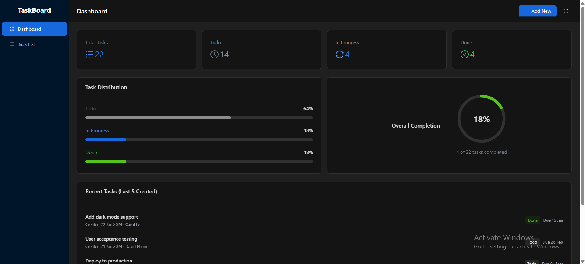
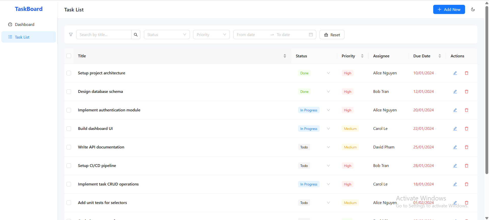
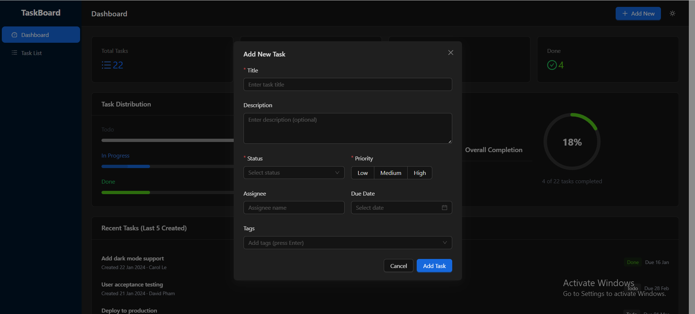
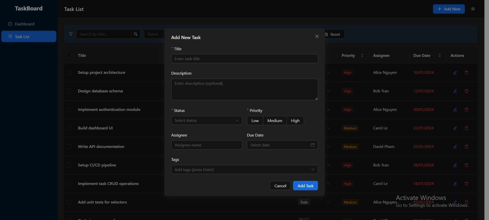

# TaskBoard

Ứng dụng quản lý công việc nội bộ, xây dựng bằng React 18 + TypeScript + Ant Design 5 + Redux Toolkit 2.

## Tech stack

- React 18 + TypeScript 5 (strict mode)
- Ant Design 5.x
- Redux Toolkit 2.x
- Tailwind CSS 3.x
- Vite
- React Router v7
- dayjs

## Cài đặt

```bash
git clone https://github.com/trandinhtai1512204/fe-test-TranDinhTai.git
cd fe-test-TranDinhTai
npm install
npm run dev
```

## Scripts

```bash
npm run dev       
npm run build   
npm test        
```

## Tính năng

**Dashboard**
- 4 card thống kê: tổng task, todo, in progress, done
- Progress bar hiển thị tỉ lệ theo trạng thái + vòng tròn completion
- 5 task được tạo gần nhất

**Task List**
- Bảng có phân trang (10 item/trang), sort theo tiêu đề / độ ưu tiên / hạn chót
- Thêm / sửa task qua modal (nút header hoặc double-click vào dòng)
- Xoá từng task hoặc xoá hàng loạt (chọn nhiều dòng)
- Đổi trạng thái nhanh ngay trên bảng, không cần mở modal

**Tìm kiếm & lọc**
- Tìm theo tiêu đề (debounce 300ms)
- Lọc theo trạng thái (multi-select), độ ưu tiên, khoảng ngày hạn chót
- Bộ lọc được sync lên URL — có thể share link hoặc back/forward trình duyệt
- Toàn bộ logic lọc nằm trong Redux selector, không xử lý trong component

**Khác**
- Dark mode toggle
- Unit test cho selectors và Dashboard component

## Demo






## Thư viện bổ sung

| react-router-dom v7 | routing giữa Dashboard và Task List |
| dayjs | format và so sánh ngày, cũng được Ant Design DatePicker dùng nội bộ |
